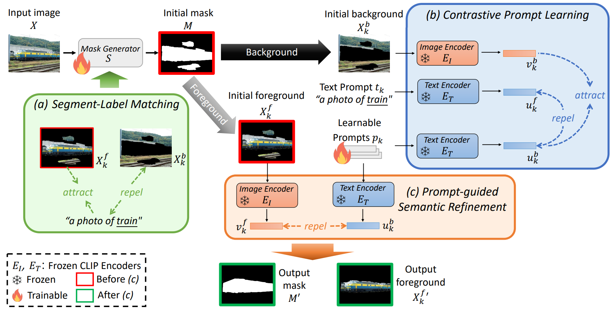

[](https://paperswithcode.com/sota/weakly-supervised-semantic-segmentation-on-1?p=semples-semantic-prompt-learning-for-weakly)<br>
[](https://paperswithcode.com/sota/weakly-supervised-semantic-segmentation-on?p=semples-semantic-prompt-learning-for-weakly)<br>
[](https://paperswithcode.com/sota/weakly-supervised-semantic-segmentation-on-4?p=semples-semantic-prompt-learning-for-weakly)

<h1 align="center">
    <p> Semantic Prompt Learning for <br> Weakly-Supervised Semantic Segmentation <br>  [WACV 2025]</p>
</h1>

<h1 align="center"> 
    
</h1>

The Official PyTorch implementation of [**Semantic Prompt Learning for Weakly-Supervised Semantic Segmentation**](https://arxiv.org/abs/2401.11791) [WACV 2025].

[Ci-Siang Lin*](http://vllab.ee.ntu.edu.tw/students.html), [Chien-Yi Wang](https://chienyiwang.github.io/), [Yu-Chiang Frank Wang](http://vllab.ee.ntu.edu.tw/ycwang.html), [Min-Hung Chen](https://minhungchen.netlify.app/) <br>
(* Work done during an internship at NVIDIA.)

[[`Paper`](https://arxiv.org/abs/2401.11791)] [[`Website`](https://projectdisr.github.io/semples/)] [[`BibTeX`](#citation)]

Weakly-Supervised Semantic Segmentation (WSSS) aims to train segmentation models using image data with only image-level supervision. Since precise pixel-level annotations are not accessible, existing methods typically focus on producing pseudo masks for training segmentation models by refining CAM-like heatmaps. However, the produced heatmaps may capture only the discriminative image regions of object categories or the associated co-occurring backgrounds. To address the issues, we propose a Semantic Prompt Learning for WSSS (SemPLeS) framework, which learns to effectively prompt the CLIP latent space to enhance the semantic alignment between the segmented regions and the target object categories. More specifically, we propose Contrastive Prompt Learning and Prompt-guided Semantic Refinement to learn the prompts that adequately describe and suppress the co-occurring backgrounds associated with each target object category. In this way, SemPLeS can perform better semantic alignment between object regions and the associated class labels, resulting in desired pseudo masks for training the segmentation model. The proposed SemPLeS framework achieves SOTA performance on the standard WSSS benchmarks, PASCAL VOC and MS COCO, and shows compatibility with other WSSS methods.

## Preparation


### Environment

```bash
conda create --name semples python=3.7
conda activate semples
conda install pytorch==1.9.0 torchvision==0.10.0 torchaudio==0.9.0 cudatoolkit=11.3 -c pytorch -c conda-forge
pip install -r requirements.txt
pip install -U openmim
mim install mmcv-full==1.4.0
pip install mmsegmentation==0.30.0
pip install --force-reinstall cython==0.29.36
pip install --no-build-isolation git+https://github.com/lucasb-eyer/pydensecrf.git


pip install ftfy regex tqdm
cd CLIP-main/
pip install -e .

pip install tensorboard
pip install setuptools==59.5.0
```

### Data

#### Pascal VOC 2012
- First download the Pascal VOC 2012 datasets use the scripts in the `data` dir.

```bash
cd data
sh download_and_convert_voc12.sh
```
- Then download SBD annotations from [here](https://www.dropbox.com/s/oeu149j8qtbs1x0/SegmentationClassAug.zip).

The folder structure is assumed to be:
```bash
WeakTr
├── data
│   ├── download_and_convert_voc12.sh
│   ├── voc12
│   │   ├── VOCdevkit
│   │   │   ├── VOC2012
│   │   │   │   ├── JPEGImages
│   │   │   │   ├── SegmentationClass
│   │   │   │   ├── SegmentationClassAug
├── voc12
│   ├── cls_labels.npy
│   ├── train_aug_id.txt
│   ├── train_id.txt
│   ├── val_id.txt
```

#### COCO 2014 
- First download the COCO 2014 datasets use the scripts in the `data` dir.

```bash
cd data
sh download_and_convert_coco.sh
cp ../coco/val_5000.txt coco/voc_format
```
The folder structure is assumed to be:
```bash
WeakTr
├── data
│   ├── download_and_convert_coco.sh
│   ├── voc12
│   ├── coco
│   │   ├── images
│   │   ├── voc_format
│   │   │   ├── class_labels
│   │   │   ├── train.txt
│   │   │   ├── val.txt
│   │   │   ├── val_5000.txt
├── voc12
│   ├── cls_labels.npy
│   ├── train_aug_id.txt
│   ├── train_id.txt
│   ├── val_id.txt
├── coco
│   ├── cls_labels.npy
│   ├── train_id.txt
│   ├── train_1250_id.txt
│   ├── val_id.txt
│   ├── val_5000.txt
```

### Model

Prepare the model checkpoints from [WeakTr](https://github.com/hustvl/WeakTr).

## Training and Evaluation
### Pascal VOC 2012

Training (a)-(c)
```bash
CUDA_VISIBLE_DEVICES=0 python main1.py --batch-size 64 --epochs 60 --reduction 8 --pool-type max --lr 0.000512 --data-set VOC12 --output_dir semples1/voc --resume WeakTr_results/WeakTr/checkpoint_best_mIoU.pth --num_workers 8 --img-ms-list voc12/train_id.txt --gt-dir SegmentationClass --cam-npy-dir semples1/voc/attn-patchrefine-npy --scales 1.0 --hypers 2.4

CUDA_VISIBLE_DEVICES=0 python main2.py --batch-size 128 --epochs 60 --reduction 8 --pool-type max --lr 0.1 --data-set VOC12 --output_dir semples2/voc --resume semples1/voc/checkpoint_best_mIoU.pth --num_workers 8 --img-ms-list voc12/train_id.txt --gt-dir SegmentationClass --cam-npy-dir semples2/voc/attn-patchrefine-npy --scales 1.0 --hypers 0.02 --btp_length 30

CUDA_VISIBLE_DEVICES=0 python main3.py --batch-size 64 --epochs 60 --reduction 8 --pool-type max --lr 0.000512 --data-set VOC12 --output_dir semples3/voc --resume WeakTr_results/WeakTr/checkpoint_best_mIoU.pth --num_workers 8 --img-ms-list voc12/train_id.txt --gt-dir SegmentationClass --cam-npy-dir semples3/voc/attn-patchrefine-npy --scales 1.0 --hypers 2.4 0.05 --btp_length 30 --btp_path semples2_0.02/voc/btp.pth
```

CAM Generation and Evaluation
```bash
CUDA_VISIBLE_DEVICES=0 python -m torch.distributed.launch --nproc_per_node=1 --master_port=14898 main1.py --epochs 60 --reduction 8 --pool-type max --lr 0.000512 --data-set VOC12MS --output_dir semples3/voc --resume semples3/voc/checkpoint_best_mIoU.pth --num_workers 8 --gen_attention_maps --attention-dir semples3/voc/attention_maps --img-ms-list voc12/train_id.txt --gt-dir SegmentationClass --cam-npy-dir semples3/voc/attn-patchrefine-npy-ms --scales 1.0 1.2 --hypers 2.4

python evaluation.py --list voc12/train_id.txt --data-path data --type npy --predict_dir semples3/voc/attn-patchrefine-npy-ms --out-dir semples3/voc/pseudo-mask-ms-crf --curve True --start 40
```

### COCO 2014

Training (a)-(c)
```bash
CUDA_VISIBLE_DEVICES=0 python main1.py --batch-size 32 --epochs 60 --reduction 4 --pool-type avg --lr 0.00000512 --data-set COCO --output_dir semples1/coco --resume WeakTr_results_coco/WeakTr/checkpoint_best_mIoU.pth --num_workers 8 --img-ms-list coco/train_1250_id.txt --gt-dir voc_format/class_labels --cam-npy-dir semples1/coco/attn-patchrefine-npy --scales 1.0 --hypers 0.75

CUDA_VISIBLE_DEVICES=0 python main2.py --batch-size 128 --epochs 60 --reduction 4 --pool-type avg --lr 0.01 --data-set COCO --output_dir semples2/coco --resume semples1/coco/checkpoint_best_mIoU.pth --num_workers 8 --img-ms-list coco/train_1250_id.txt --gt-dir voc_format/class_labels --cam-npy-dir semples2/voc/attn-patchrefine-npy --scales 1.0 --hypers 0.01 --btp_length 30

CUDA_VISIBLE_DEVICES=0 python main3.py --batch-size 24 --epochs 60 --reduction 4 --pool-type avg --lr 0.00000512 --data-set COCO --output_dir semples3/coco --resume WeakTr_results_coco/WeakTr/checkpoint_best_mIoU.pth --num_workers 8 --img-ms-list coco/train_1250_id.txt --gt-dir voc_format/class_labels --cam-npy-dir semples3/coco/attn-patchrefine-npy --scales 1.0 --hypers 0.75 0.2 --btp_length 30 --btp_path semples2_0.01/coco/btp.pth

```

CAM Generation and Evaluation
```bash
CUDA_VISIBLE_DEVICES=0,1,2,3,4,5,6,7 python -m torch.distributed.launch --nproc_per_node=8 --master_port=14898 main1.py --epochs 60 --reduction 4 --pool-type avg --lr 0.00000512 --data-set COCOMS --output_dir semples3/coco --resume semples3/coco/checkpoint_best_mIoU.pth --num_workers 64 --gen_attention_maps --attention-dir semples3/coco/attention_maps --img-ms-list coco/train_id.txt --gt-dir voc_format/class_labels --cam-npy-dir semples3/coco/attn-patchrefine-npy-ms --scales 1.0 0.8 1.2 --hypers 0.75

python evaluation.py --list coco/train_id.txt --data-path data --type npy --predict_dir semples3/coco/attn-patchrefine-npy-ms --out-dir semples3/coco/pseudo-mask-ms-crf --num_classes 91 --curve True --start 40
```

When CAMs are obtained, please refer to [FMA-WSSS](https://github.com/HAL-42/FMA-WSSS) for producing pseudo masks and training the final segmentation model.


## Citation
If you find this useful for your research, please consider citing:
```bibtex
@article{lin2024semples,
  title={SemPLeS: Semantic Prompt Learning for Weakly-Supervised Semantic Segmentation},
  author={Lin, Ci-Siang and Wang, Chien-Yi and Wang, Yu-Chiang Frank and Chen, Min-Hung},
  journal={arXiv preprint arXiv:2401.11791},
  year={2024}
}
```

## Licenses
Copyright © 2024, NVIDIA Corporation. All rights reserved.

This work is made available under the NVIDIA Source Code License-NC. Click [here]() to view a copy of this license.
